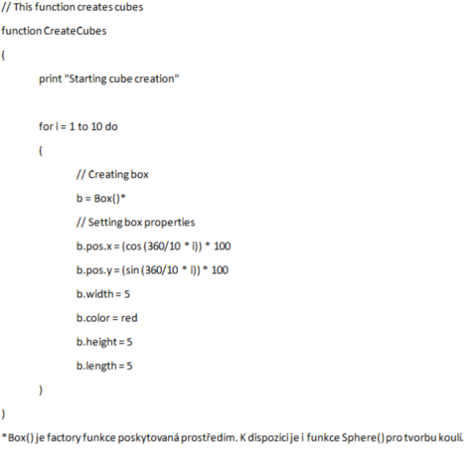

# Warhorse Studios - TechOps test

## Documentation

Write a user documentation for a hammer. 

## Clean coding

Below is a pseudo-code that positions cubes along a circle. 
Rewrite it with these priorities: readability, extensibility, maintainability, and modularity. 
You can assume that you work in a weakly typed language with functions being first class citizens.  
  
**Add an option to support balls.**  
**Add an option to change color.**  
**Add an option to change the number of boxes.**  

## Architecture  
  
Design an architecture for a clone of Asteroids game.  
Currently the game design looks like so:  
After launching the game a ship immediately appears in the center of the screen and asteroids start 
to fly in from the side. Players can make the ship shoot asteroids and for each destroyed one gets some score. 
They also get score for each second survived. With time more and more asteroids are emitted. 
Whenever players' ship gets hit by an asteroid 
it is destroyed and the game over screen shows up prompting restart or quitting.  
  
You work on the game with your friend who is constantly coming up with changes and additions. 
You have big plans for the game and would like to continue the development for many years.  
  
You can use UML or describe everything with words.
Most important is to describe individual classes and their responsibilities. 
In case you plan to use some design patterns please write which ones. The readability of the design is also important.  
  
## UX and communication  
  
You are maintaining a tool for management of items that a player can find in the game. User can create new items, 
delete existing ones or edit their attributes. Items have these attributes:  
  
* Name – shows in inventory and on a pick up prompt in-game.
* Description – shows in inventory
* Weight - shows in inventory
* Price – shows in inventory and in shopping UI
* Path to model – model shows in game.  
  
Data are saved as XML. The user submits XML into a versioning system.
  
You receive the following e-mail: “What the heck are you doing there?! 
I created twenty new items on Friday and they are not there today. The tool is broken again. 
Do you have any idea how much time I'm losing  on this?”  
Please write a response using the information you have on hand.  
  
We would like to validate the data added. Please think about which attributes should be validated how. 
Don't hesitate to speculate if you're not sure if something is needed.  
  
Design a wireframe for the tool. Think about usage and if relevant describe an interaction with individual UI elements. 
You can use any tool you want for the wireframe design, pen and paper included.
